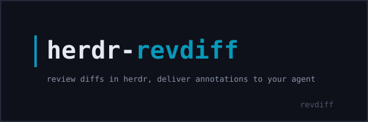

# herdr-revdiff

[](https://github.com/alexeyco/herdr-revdiff/actions/workflows/ci.yml)
[](LICENSE)
[](https://www.rust-lang.org)



herdr plugin that reviews diffs with [revdiff](https://github.com/umputun/revdiff) and delivers the resulting annotations to the agent in the focused pane.

[herdr](https://herdr.dev) is a terminal workspace manager and agent multiplexer; [revdiff](https://github.com/umputun/revdiff) is a Go TUI that reviews a diff and writes inline annotations. This plugin bridges them: one keypress opens a tab straight into the revdiff TUI rooted at the repository, and when you quit revdiff with annotations, they are sent to the focused agent as a prompt. It targets the herdr plugin API v1 and runs on Linux and macOS (Windows untested).

## Demo

One keypress opens a `revdiff` tab rooted at the repository; when you quit revdiff with annotations, they arrive in the focused agent as a single prompt.

<!-- TODO: record a short demo GIF or asciinema cast (keypress → revdiff TUI → annotations delivered) and embed here; keep it under ~15s -->

## Quickstart

```
herdr plugin install alexeyco/herdr-revdiff
```

Bind a key in your herdr config:

```toml
[[keys.command]]
key = "prefix+shift+r"
type = "plugin_action"
command = "revdiff.review"
description = "Review changes with revdiff"
```

Or invoke the action from the CLI:

```
herdr plugin action invoke revdiff.review
```

## Why

- **No git index mutation.** The repository state is probed read-only; the plugin never writes to the index. Third-party integrations that run `git add -A` to force a full staged diff are deliberately not followed.
- **Instant TUI.** Plugin pane commands are argv-exec, not send-text, so there is no shell layer and no echoed command line before revdiff appears.
- **Agent-agnostic.** Annotations go to whichever agent herdr reports in the focused pane; no agent kind is special-cased.
- **Kept output is pruned.** Review output that cannot be delivered stays on disk and is pruned automatically after 7 days.
- **Linux and macOS, ARM included.** Release binaries cover `x86_64` and `aarch64` on both platforms.

## Requirements

- herdr >= 0.9.0
- [revdiff](https://github.com/umputun/revdiff) >= 1.12 with the `revdiff` binary on `PATH` (the plugin needs `--exit-code-on-annotations`)
- Rust toolchain 1.96.1 (the plugin builds itself on install)

If revdiff is not on the `PATH` of the herdr daemon, or you want a specific build, export `REVDIFF_BIN=/path/to/revdiff` in the session where herdr is launched; the daemon inherits it, and a herdr restart picks up a change.

Release binaries are unsigned. macOS may quarantine them on first run; `xattr -d com.apple.quarantine <path>` clears the quarantine flag until the binaries are signed and notarized.

## Usage

Any chord works; see the [herdr keyboard docs](https://herdr.dev/docs/keyboard/) for picking one that your terminal doesn't swallow.

The action resolves the repository directory from the plugin context and opens a `revdiff` tab whose pane runs revdiff directly, so the tab opens straight into the TUI (no shell echo). The review mode is selected from the current git state:

| Situation                                 | What is reviewed                                 |
| ----------------------------------------- | ------------------------------------------------ |
| Not a git work tree                       | Working tree (bare `revdiff`)                    |
| Git repo with no commits yet              | All files (`--all-files`)                        |
| Clean tree with a parent commit           | Last commit (`HEAD~1`)                           |
| Staged changes, nothing else              | Staged diff (`--staged`)                         |
| Unstaged and/or untracked changes present | Working tree and untracked files (`--untracked`) |

The action itself returns immediately; the pane process waits for revdiff, then closes the review pane and delivers any annotations to the agent pane that launched the action. If there is no agent to receive them, or revdiff fails, the pane prints the message and waits for Enter before closing. Annotations that cannot be delivered are kept on disk and their path is printed. Exit codes and the full lifecycle are in [docs/how-it-works.md](docs/how-it-works.md).

## Development

See [CONTRIBUTING.md](CONTRIBUTING.md) and [docs/development.md](docs/development.md).

## Changelog

See [CHANGELOG.md](CHANGELOG.md).

## License

[MIT](LICENSE)
